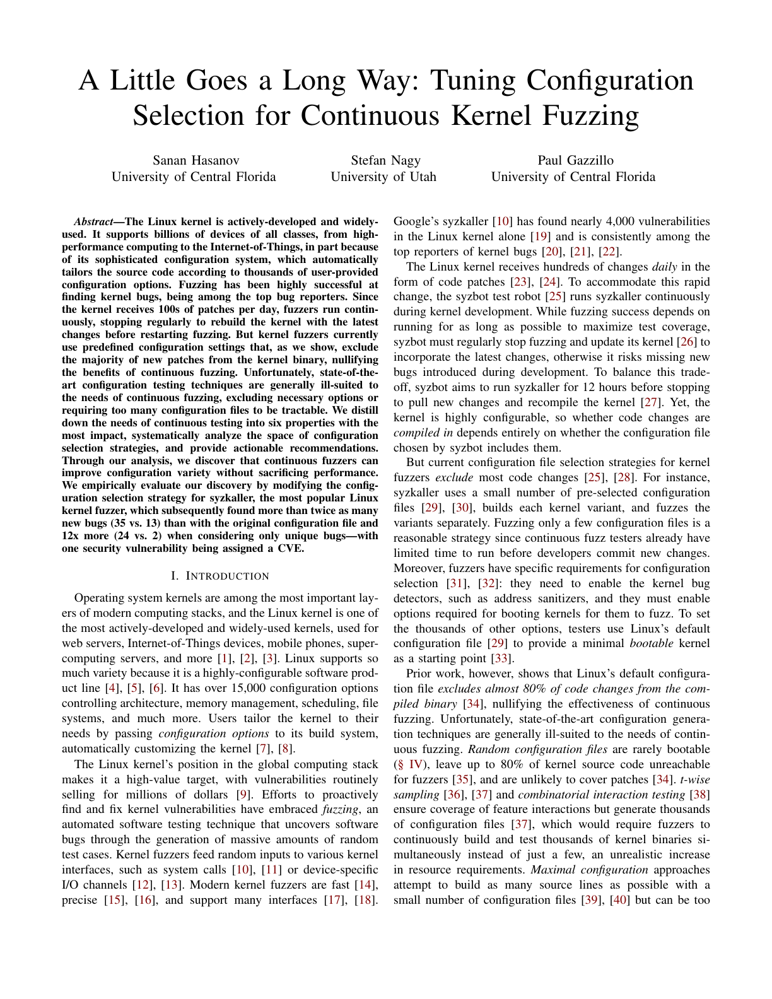

# A Little Goes a Long Way: Tuning Configuration Selection for Continuous Kernel Fuzzing

<p><a href="https://paulgazzillo.com/papers/icse25.pdf"></a></p>

The Linux kernel is actively-developed and widely used.
It supports billions of devices of all classes, from high-performance computing
to the Internet-of-Things, in part because of its sophisticated configuration
system, which automatically tailors the source code according to thousands of
user-provided configuration options.
Fuzzing has been highly successful at finding kernel bugs, being among the top
bug reporters. Since the kernel receives 100s of patches per day, fuzzers run
continuously, stopping regularly to rebuild the kernel with the latest
changes before restarting fuzzing.
But kernel fuzzers currently use predefined configuration settings that, as we
show, exclude the majority of new patches from the kernel binary,
nullifying the benefits of continuous fuzzing.
Unfortunately, state-of-the-art configuration testing techniques are generally
ill-suited to the needs of continuous fuzzing, excluding necessary options or
requiring too many configuration files to be tractable.
We distill down the needs of continuous testing into six properties with the
most impact, systematically analyze the space of configuration selection strategies,
and provide actionable recommendations.
Through our analysis, we discover that continuous fuzzers can improve configuration
variety without sacrificing performance.
We empirically evaluate our discovery by modifying the configuration selection
strategy for syzkaller, the most popular Linux kernel fuzzer, which subsequently
found more than twice as many new bugs (35 vs. 13) than with the original
configuration file and 12x more (24 vs. 2) when considering only unique bugs—with
one security vulnerability being assigned a CVE.

For more information, please refer to [our paper](https://paulgazzillo.com/papers/icse25.pdf)
from ICSE25.

[experiments](experiments/) directory contains instructions, data, and scripts
to reproduce the experiments in the paper.

You can follow [SUMMARY.md](SUMMARY.md) for a summary of the experimental setup and
set of actions that are performed during experiments.

## Guide to the Artifacts
*Note:* Please make sure to follow the steps below after entering the repo:
1. To be able to run the scripts, you need to have [kmax](https://github.com/paulgazz/kmax) and [syzkaller](https://github.com/google/syzkaller) installed.
Please refer to the installation instructions of these tools to install them.
2. Please also make sure to use Python3 3.9 or above to able to run the scripts in this repository.
3. Make sure to enable kmax virtual environment before running the scripts.
4. You will need the contents of "repaired_reproducers.7z" and "repaired_bugs.7z" files when running some of the scripts.
Since they are files large in size, you have to pull them first with 'git lfs pull' command once you clone the repository.
After pulling the files, you can extract them with the commands below:
```
7z x repaired_reproducers.7z
7z x repaired_bugs.7z
```
4. You will need a linux-next repo that contains the linux-next daily tags to be able to run the scripts in this repository.
You can find our linux-next repo that contains the tags we used in the experiments [here](https://drive.google.com/file/d/1H_aNBlJZ9qBLF0gvOflBE3-rou0EEbmT/view?usp=sharing)
Extract the repo with the following command:
```
7z x linux-next.7z
```

### Change Summary Study

We evaluated how our approach changed the number of configuration options of the original Syzkaller configuration files used in the experiments.
krepair_syzkaller_evaluation/change_summary_2.sh script was used to evaluate the change in number of configuration options of repaired Syzkaller configuration files against the total number of the configuration options available on the configuration system.
The number of total configuration options was obtained from the configuration system of the Linux kernel using find_total_config_option_count.sh script. The CSV file that contains the names of the original and repaired Syzkaller configuration, and patch commits that are used to repair the original configuration files can be found at change_of_summaries_bug_finding_coverage.csv The CSV file that contains the names of the original and repaired Syzkaller configuration, and patch commits that are used to repair the original configuration files is change_of_summaries_bug_finding_coverage.csv.
We calculated the change of summary percentile information and represented them in a table. You can view Table(Number of configurations options changed by krepair) to see the results of the change summary study.
## Artifacts

- build_allnoconfig.sh - This script is used to build the Linux kernel with an allnoconfig configuration file.
- build_allyesconfig.sh - This script is used to build the Linux kernel with an allyesconfig configuration file.
- calculate_confidence_interval.py - This script is used to calculate the confidence intervals of the coverage of Syzkaller and repaired configuration files and provides a bar chart to visualize the results.
- change_of_summaries_bug_finding_coverage.csv - this CSV file contains the names of the original and repaired Syzkaller configuration, and patch commits that are used to repair the original configuration files.
- defconfig_config_patchcoverage.txt - this file contains the patch coverage of defconfig configuration files.
- defconfig_krepair_patchcoverage.txt - this file contains the patch coverage of repaired defconfig configuration files.
- find_total_config_option_count.sh - This script is used to get the number of configuration options available in the configuration system of the Linux kernel.
- get_percentage_change.py - this script is used to measure the change in the number of configuration options of repaired Syzkaller configuration files against the total number of configuration options available on the configuration system.
- kafl_config_patchcoverage.txt - this file contains the patch coverage of kAFL configuration files.
- kaf_krepair_patchcoverage.txt - this file contains the patch coverage of repaired kAFL configuration files.
- syzkaller_config_patchcoverage.txt - this file contains the patch coverage of Syzkaller configuration files.
- krepair_patchcoverage.txt - this file contains the patch coverage of repaired Syzkaller configuration files.
- links_to_syzkaller_configuration_used.txt - this file contains the links to the syzkaller configuration files used during fuzzing experiments.
- test_100_randconfigs.py - this script is used to generate 100 configuration files with randconfig utility, build kernel images with them, and try to boot the kernel images with QEMU.
- kafl_krepair_experiment_j8.csv - this file contains the results of the replication study for kAFL and repaired kAFL configuration files.
- syzkaller_krepair_experiment_j8.csv - this file contains the results of the replication study for Syzkaller and repaired Syzkaller configuration files.
- defconfig_krepair_experiment_j8.csv - this file contains the results of the replication study for defconfig and repaired defconfig configuration files.
## repairer_script folder

- addr2line_inside_ifdef.py - This script compares two text files to identify lines that are different between them and determines whether these differing lines are located within conditional compilation blocks marked by #ifdef or #if in the source code. It reads the files, computes the differences, and then checks if each differing line is inside a #ifdef or #if block, printing the results.
- block_coverage_bar_chart.py - This script visualizes a comparison of code coverage, measured in the number of blocks, between two fuzzing with and without config variety, "Our Approach" and "Syzkaller" respectively, across multiple experimental runs. It plots sorted coverage data as side-by-side bars for each tool on a bar chart, labeling the y-axis with coverage values. The plot is saved to a PDF file named 'block_coverage_comparison_chart.pdf'.
- bugs_unique_and_common.py - This script is used for comparing unique and common crash names found by fuzzing with and without configuration variety. It needs crash names belonging to fuzzing with configuration variety in column 1 and crash names belonging to fuzzing without configuration variety in column 2.
- build_kernel.sh - This script is used to build the Linux kernel with a given configuration file and commit hash. Built kernel images are needed to run them in QEMU to test whether reproducers of crashes crash on kernels built with and without configuration variety.
- categorize_bugs_bar_chart.py - This script is used for categorizing all crashes found by fuzzing with configuration variability based on their types. It reads the names of the crashes from the provided CSV file and categorizes them into different types, then visualizes the results as a bar chart and saves it to a PDF file named 'categorized_bugs_bar_chart.pdf'.
- collect_reproducers.sh - This script reads the names and paths to the reproducers of crashes from the repaired_reproducers.csv file and checks the type of the reproducer.
Example command to run the script:
```bash
./collect_reproducers.sh guild_reproducers/ repairer_script/repaired_reproducers.csv guild_bugs/
```
- find_reproducers.sh - this script is used for finding reproducers and their types (C or syz) in repaired_bugs folders, the folder that stores folders of bugs found during fuzzing with configuration variety. It generates reproducers.csv files and stores them there.
- find_unique_crash.py - This script is used to find unique alarm names + call trace pairs from the results of fuzzing with and without configuration variety. It reads the results from the provided CSV file and finds unique alarm names + call trace pairs, then saves them to a new CSV file.
- fuzzing_experiments.sh - This script is used to perform fuzzing without configuration variety using Syzkaller. It uses a configuration file arbitrarily selected from the Syzbot dashboard and a Linux-next tag to check out to build the kernel and starts fuzzing with Syzkaller while saving the outputs.
- get_call_trace.py - This Python script automates the process of extracting call traces from Syzkaller bug reports, categorizing them based on uniqueness, and compiling bug statistics.
- get_source_lines_of_code_default.sh - This script is used to get the number of source lines of code of the Linux kernel binary built with configuration file without configuration variety.
- get_source_lines_of_code_repaired.sh - This script is used to get the number of source lines of code of the Linux kernel binary built with a configuration file with configuration variety.
- repaired_bugs.csv - a CSV file that contains the names of all crashes found by fuzzing with configuration variety.
- repaired_bugs2.csv - a CSV file that contains the names of all previously unreported crashes found by fuzzing with configuration variety.
- repaired_reproducers.csv - a CSV file that contains the names of all crashes found by fuzzing with configuration variety that has reproducers. It stores the names of the crashes, reproducer types, and paths to the reproducers.
- ifdef_find_bug_relevance.py - this script checks whether configuration options related to files that contain definitions of functions found in the call trace of a bug's Syzkaller report or configuration options related to conditional blocks that may cover the call of those functions exist in configuration files with and without configuration variety.
- kernel_size_and_modules.py - This script automates the process of compiling the Linux kernel with different configurations, measuring the size of the resulting kernel images and modules, and logging the results to a CSV file. It iterates over rows in an input CSV file, each specifying a commit ID and paths to Syzkaller and repaired configuration files. For each row, the script checks out the specified commit, cleans the kernel directory, applies both configurations (with and without configuration variety, Syzkaller and repaired) one after the other, compiles the kernel, and calculates the size of the compiled kernel image (bzImage) and modules. The sizes are then logged in the CSV file along with the commit ID and configuration file names, facilitating the comparison of kernel sizes across different configurations and commits.
- source_lines.csv - this csv is used by get_source_lines_of_code_default.sh and get_source_lines_of_code_repaired.sh to get configuration file names, commit IDs, and Linux-next tags.
- source_lines.sh - This script is designed to process C source files (*.c) in a specified Linux kernel directory, attempting to find corresponding preprocessed files (*.i). For each .c file with a matching .i file, it extracts lines from the .i file that originated from the .c file, saving these lines to a new text file. The script is used by get_source_lines_of_code_default.sh and get_source_lines_of_code_repaired.sh to extract source lines of code from the Linux kernel binary.
- syscall_exec_bar_chart.py - this script is used to generate a bar chart to compare the throughput of fuzzing with and without configuration variety. It uses throughput data manually obtained from data_tables/Table_of_all_crashes.xlsx.
- time_taken_scatterplot.py - This script is used to visualize the time taken to find bugs found by fuzzing with and without configuration variety.
- venn_diagram.py - This script is used to generate Venn diagrams to compare unique and common bugs found by fuzzing with and without configuration variety. It uses data manually obtained from data_tables/Table_of_all_crashes.xlsx.
